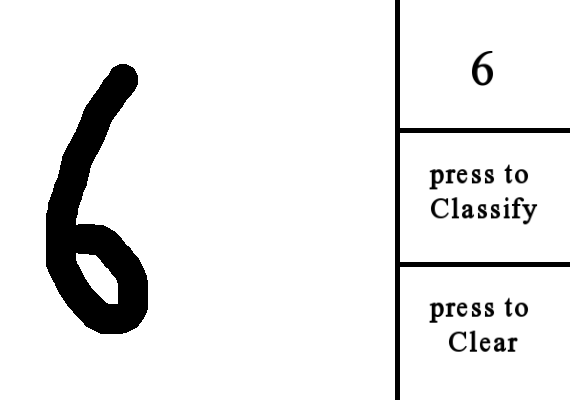
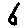
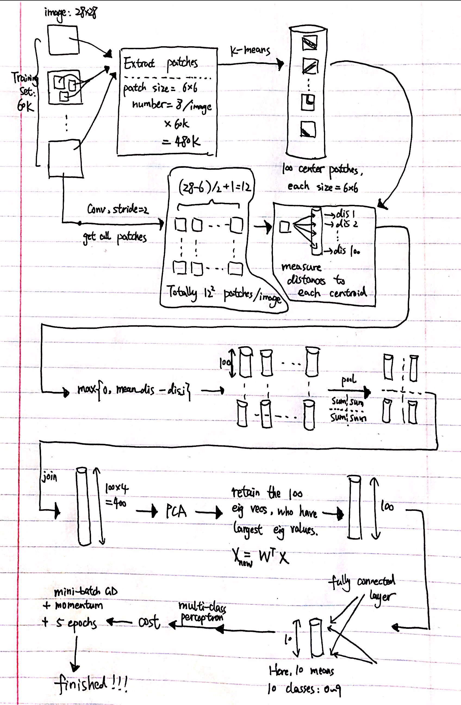
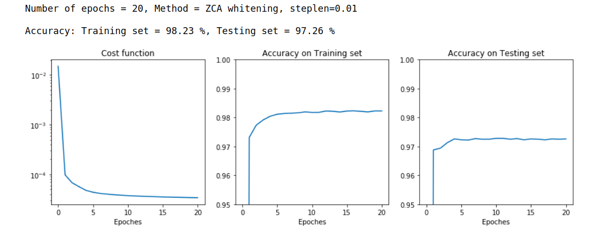
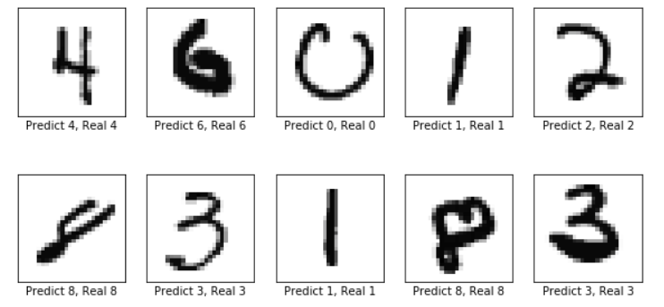
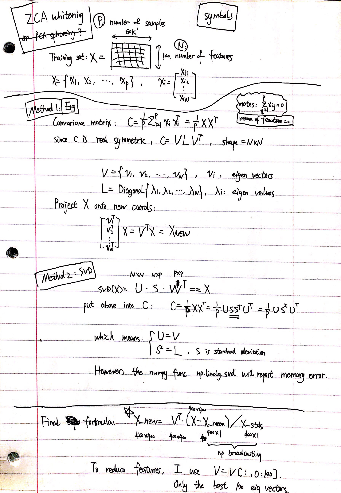

Project:   
Draw_Digit_then_Classify

Short intro:  
A GUI written in Cpp. Draw a digit and see the recognition result. Training: k-means extracts patch features + PCA.

Purpose:  
Practice machine learning and c/c++ coding. Also, I like making small game.

# Contents
- [Contents](#contents)
- [1. Introduction](#1-introduction)
  - [1.1 How to run](#11-how-to-run)
  - [1.2 How to compile](#12-how-to-compile)
  - [1.3 Cpp scripts](#13-cpp-scripts)
  - [1.4 Python script](#14-python-script)
- [2. Dependency](#2-dependency)
- [3. Algorithm](#3-algorithm)
- [4. Training results](#4-training-results)
- [5. Reference](#5-reference)
- [6. Appendix: Formula of ZCA](#6-appendix-formula-of-zca)

# 1. Introduction   
## 1.1 How to run
install SFML, and run:
> $ ./run_this_GUI

You can draw one digit on the GUI. Press "Classify", and see if the program recognizes the digit's value. 

See an exampe below, the recognition result is shown on the right up corner:   

The cropped and resized image (28x28) used for classification is shown below:  

## 1.2 How to compile  
> $ mkdir bin; mkdir build; cd build; cmake ..; make; cd ..

To run the GUI:  
> $ ./bin/GUI_main

To run the test script (which recognizes the digit in "test/test_image.png"):  
> $ ./bin/test_digit_classifier

## 1.3 Cpp scripts
The GUI is written in c++ using [SFML](https://www.sfml-dev.org/). The main file is [src/GUI_main.cpp](src/GUI_main.cpp).  
The scipt creats a GUI, reads in user's drawing, uses the data trained by Python script to classify the digit, and shows the result on GUI. 

Some functions for the GUI are in [src/GUI_lib.cpp](src/GUI_lib.cpp) and [src/GUI_button.cpp](src/GUI_button.cpp).

Functions for resizing the image to 28x28, as well as classifying the digit are in [src/digit_classifier.cpp](src/digit_classifier.cpp). Weights trained by Python are in [src/digit_classifier_data.h](src/digit_classifier_data.h).

## 1.4 Python script
It's this file **src/k-means.ipynb**.  
The machine learning algorithm is trained in it, which then outputs the weights and params for my c++ program.

# 2. Dependency
* Anaconda, Jupyter notebook
* SFML 2.5.1  
its [github](https://github.com/SFML/SFML) and [Official install instruction](https://www.sfml-dev.org/tutorials/2.5/start-linux.php).  
Short instruction:
  * method 1: sudo apt-get install libsfml-dev (This might install SFML 2.4, different from mine.)
  * method 2: download from this link, unzip, and copy the contents of its three folders, i.e. "lib", "include", "share", to the corresponding folders in "/usr/".
  

# 3. Algorithm

For the algorithm, I used:  
k-means to extract patch centers + ZCA(PCA) + fc layer + multi-class perceptron. 

The details are described below:

* Extract features  
Extract a bunch of small patches from training set. Use k-means to get 100 center patches. For each image, conv it to get all the patches inside it. Measure the distance between each patch and each k-means' center. Pool and then connect all features. ZCA whitenning. 

* Cost  
Fully-connect layer + multi-class perceptron

* Optimization  
mini-batch GD + gradient descent.  
Momentum is added but set to 0, because PCA has already made the data pretty circular.

I've drawn an image to illustrate the workflow:

# 4. Training results

You can see the detials in **src/k-means.ipynb**.  

The classification accuracy on the training set (60000) and testing test (10000) of MNIST are:   

Some examples of classification results are shown below:  

# 5. Reference
1. The algorithm of **using k-means to extract features** referenced [this Chinese tutorial](https://www.cnblogs.com/tornadomeet/archive/2013/04/12/3016319.html), which uses MATLAB code
from somewhere in [here](http://web.eecs.umich.edu/~honglak/) and is based on this [paper](http://ai.stanford.edu/~ang/papers/aistats11-AnalysisSingleLayerUnsupervisedFeatureLearning.pdf).

2. I took Prof. Jeremy Watt's machine learning course last quarter. Some of my code is using/based on code from his [github](https://github.com/jermwatt/mlrefined/tree/gh-pages/blog_posts). Many knowledge of this project were learned from this course.

# 6. Appendix: Formula of ZCA
I also written down the formula of ZCA (or say PCA sphereing?) as below:  

